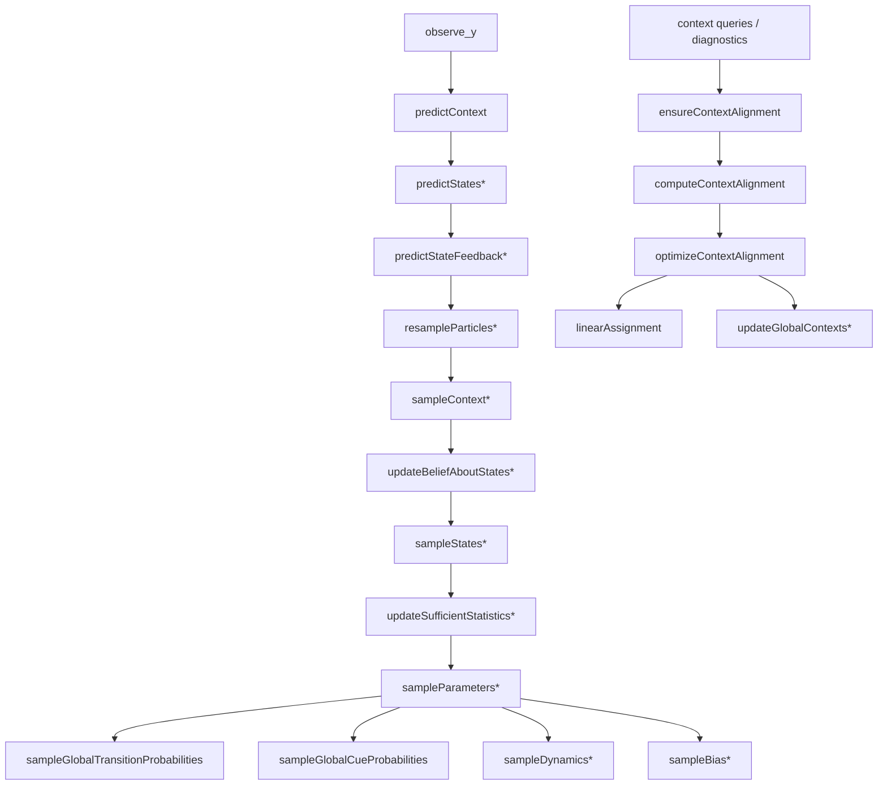

# Scientific Code Review — RealTimeCOIN

A structured review of the `@RealTimeCOIN` MATLAB class and its `tests/` and `validation/`
suites. The project is a **real-time / sequential** re-implementation of the COIN (COntextual
INference) motor-learning model (Heald et al.). The original offline `COIN.m` at the repo root is
retained unmodified as the reference ground truth.

> **How to read the "Flags" (§6–§7).** Every flagged item was checked against the source. The
> descriptive catalog (§2–§5) was assembled with the help of automated exploration; the *findings*
> were then independently verified by reading the cited `file:line`. Several candidate "bugs"
> surfaced during exploration were **refuted** on inspection and are listed as such so they are not
> re-raised later.

---

## 1. Overview

`RealTimeCOIN` is a `handle` class implementing a particle filter over a hierarchical Bayesian
model of motor learning. Each particle carries:

- a set of **contexts** (learned online, unbounded up to `max_contexts`), each with its own linear
  Gaussian state dynamics and cue–context association;
- a **latent state** per context (scalar or `N`-dimensional);
- **sufficient statistics** for Gibbs/conjugate updates of dynamics, bias, transition and cue
  parameters.

### API (state machine)

Per trial:

1. `observe_q(q)` — stage the cue for the upcoming trial (stored in `pending_q`).
2. `observe_y(y)` — process feedback; **advances `trial`** and runs the full inference pipeline.
   `[]`/`NaN` denotes a missing observation (still counts as a trial).
3. Query methods read out posterior/predictive summaries.

### Per-trial pipeline (identical order in both branches — verified `observe_y.m:10-34`)

```
predictContext → predictStates → predictStateFeedback → resampleParticles
  → sampleContext → updateBeliefAboutStates → sampleStates
  → updateSufficientStatistics → sampleParameters
```

`state_dim == 1` runs the scalar pipeline; `state_dim > 1` runs the `*MD` variants. `predictContext`
is dimension-agnostic and shared. After the pipeline, `trial` is incremented and the context-
alignment cache is invalidated.

### Particle state `obj.D`

A single private struct of vectorized arrays (dimensions `(Cmax+1) × P` or higher-order tensors,
where `Cmax = max_contexts` and `P = num_particles`). Contexts are **particle-local labels**; a
separate lazy "context alignment" step maps them into stable global labels for reporting only — it
does **not** feed back into inference.

---

## 2. Classes & Properties

There is a single class: **`RealTimeCOIN`** (`< handle`). (`COIN.m` at the repo root is the separate,
unmodified reference and is out of scope.)

### Public properties — hyperparameters (defaults from `RealTimeCOIN.m:10-47`)

| Property | Default | Meaning |
|---|---|---|
| `num_particles` | 100 | particle count `P` |
| `max_contexts` | 10 | max contexts per particle `Cmax` |
| `state_dim` | 1 | latent/observation dimension `N` (1 ⇒ scalar pipeline) |
| `gamma_context` | 0.1 | DP novelty concentration (contexts) |
| `alpha_context` | 8.955 | DP self/transition concentration (contexts) |
| `rho_context` | 0.2501 | sticky self-transition weight (∈[0,1)) |
| `gamma_cue` | 0.1 | DP novelty concentration (cues) |
| `alpha_cue` | 25 | DP concentration (cue–context) |
| `prior_mean_retention` | 0.9425 | prior mean of retention `a` |
| `prior_mean_drift` | 0.0 | prior mean of drift `d` |
| `prior_mean_bias` | 0.0 | prior mean of bias |
| `prior_precision_retention` | `837.1²` | prior precision of `a` |
| `prior_precision_drift` | `1222.7²` | prior precision of `d` |
| `prior_precision_bias` | `70²` | prior precision of bias |
| `sigma_process_noise` | 0.0089 | process-noise std |
| `sigma_sensory_noise` | 0.03 | sensory-noise std |
| `sigma_motor_noise` | 0.0 | motor-noise std |
| `process_noise_covariance` | `[]` | MD: explicit `N×N` `Q` (else `σ_q² I`) |
| `observation_noise_covariance` | `[]` | MD: explicit `N×N` `R` (else `(σ_s²+σ_m²) I`) |
| `infer_bias` | false | infer per-context observation bias |

### Private properties — internal state (`RealTimeCOIN.m:49-57`)

| Property | Meaning |
|---|---|
| `D` | particle struct (all filter state) |
| `pending_q` | staged cue for the next `observe_y` |
| `trial` | trial counter (starts at 0) |
| `cue_values` | registry mapping raw cue values → integer labels |
| `alignment_cache` | cached global context alignment |
| `alignment_seed` | warm-start seed for the alignment optimizer |
| `state_version` | monotone counter; bumped on every mutation to invalidate the cache |

`Trial` (dependent, read-only) returns `trial`.

---

## 3. Public Methods (full entries)

Notation: **R** = properties read, **W** = properties written, **Calls** = private helpers.

### Construction & lifecycle

**`RealTimeCOIN(varargin)`** — constructor.
- In: name/value pairs. Out: `obj`.
- W: all public props, then `validateMultiDimConfig`, then `resetParticles(MD)` initializes `D`.
- Role: configure hyperparameters and initialize the single-context particle cloud.

**`observe_q(obj, q)`** (`observe_q.m`)
- In: raw cue `q` (or `[]`/`NaN`). Out: none.
- R: — . W: `pending_q` (cleared on empty/NaN, else stored).
- Role: stage the cue; **no inference** happens here.

**`observe_y(obj, y)`** (`observe_y.m`)
- In: feedback `y` (scalar or `N×1`; `[]`/`NaN` ⇒ missing). Out: none.
- R: `state_dim`, `pending_q`. W: `D` (extensively), `trial`, `state_version`, `alignment_cache`.
- Math: one full particle-filter update (predict → reweight → resample → sample context/state →
  accumulate stats → conjugate parameter update).
- Calls: `consumePendingCue`, the 9 pipeline steps (scalar or MD), `invalidateContextAlignment`.
- Role: **the** state-advancing method.

**`set_stationary(obj)`** (`set_stationary.m`)
- Resets `trial`, `pending_q`, and history to a "cold start" while keeping learned parameters.
- W: `trial`, `pending_q`, `cue_values` (and clears alignment). Role: freeze to a deployable prior.

**`saveModel(obj, filename, setStationary=true)`** / **`loadModel(obj, filename)`**
- `saveModel` serializes via `serializableState`; when `setStationary` is true it **temporarily**
  mutates trial/pending/cue state, writes, then restores the live state (see §7).
- `loadModel` restores via `restoreSerializableState`; errors on the legacy `particles` format.
- Alignment cache is **not** serialized (recomputed lazily).

### Point predictions / moments (read-only)

**`motor_output(obj)`** (`motor_output.m`)
- Out: `u` = expected feedback, scalar or `N×1`.
- Math: `u = (1/P) Σ_p Σ_c W(c,p)·state_feedback_mean(c,p)`, with `W = predicted_probabilities`.
- R: `D.predicted_probabilities`, `D.state_feedback_mean`, `state_dim`, `num_particles`,
  `max_contexts`. W: none. Role: current-trial expected motor output. (Docstring is explicit that
  weights are the *predicted* context probabilities — see §6, item F1.)

**`predictive_motor_output(obj, q?)`** (`predictive_motor_output.m`)
- In: optional cue `q` (defaults to `pending_q`). Out: `u`.
- Math: one-step look-ahead mean from a read-only `previewPredictiveFeedback(MD)`. R: `pending_q`,
  `state_dim`, `num_particles`. W: none. Calls: `peekCueLabel`, `previewPredictiveFeedback(MD)`.

**`state_moments(obj)`** (`state_moments.m`)
- Out: `mu`, `v` (predicted state mean & (co)variance). Weights: `predicted_probabilities`.
- Math: Gaussian-mixture mean / `E[V+mm']−mu·mu'`. R: `D.state_mean`, `D.state_var`,
  `D.predicted_probabilities`. W: none.

**`predictive_feedback_moments(obj, q?)`** (`predictive_feedback_moments.m`)
- Out: `mu`, `Sigma` of the one-step feedback distribution. Handles novel contexts via the
  **stationary** state distribution; adds bias and observation noise. R: dynamics, transition/cue
  matrices, filtered state, bias, `pending_q`. W: none. Central to validation and pre-trial
  prediction.

### Densities & CDFs (read-only)

**`state_probability(obj, values)`** (`state_probability.m`)
- Posterior state density `p(s | y_t)`. Weights: **`responsibilities`** (post-update).
  Scalar grid vector or MD `N×K` columns.

**`state_feedback_probability(obj, values)`** (`state_feedback_probability.m`)
- Predictive feedback density `p(y | y_{t-1})`. Weights: **`predicted_probabilities`**; means/vars
  inflated by observation noise. (Weight source matches the docstring — §6, item F1.)

**`state_given_context_probability(obj, values)`** (`state_given_context_probability.m`)
- `containers.Map`: global context label → per-context state density. **Triggers alignment** (§7).

**`predictive_state_feedback_cdf(obj, y, q?)`** (`predictive_state_feedback_cdf.m`)
- PIT / mixture CDF `P(Y ≤ y | q)` (per-dimension marginals in MD). R: transition/cue/feedback
  moments. W: none. Calls: `previewPredictiveFeedback(MD)`, `normal_cdf`.

**`predictive_cue_p_value(obj, q, u=rand)`** (`predictive_cue_p_value.m`)
- Randomized discrete PIT `F(q⁻) + u·Pr(Q=q)`; `NaN` for a never-seen cue. Calls: `peekCueLabel`,
  `previewCuePmf`. (Default `u=rand` — reproducibility note in §6, item F5.)

### Context summaries — global (aligned) vs local (fast)

| Method | Weights | Alignment? | Returns |
|---|---|---|---|
| `predicted_context_probabilities_vector` | predicted | **yes** (cache) | row vector |
| `predicted_context_probabilities_map` | predicted | **yes** (cache) | Map: label→prob |
| `responsibilities_vector` | responsibilities | **yes** (cache) | row vector |
| `responsibilities_map` | responsibilities | **yes** (cache) | Map: label→prob |
| `sampled_context_count` | context mode | **yes** (cache) | Map: label→freq |
| `predicted_context_probabilities_local` | predicted | no | row vector |
| `context_responsibilities_local` | responsibilities | no | row vector |
| `sampled_context_count_local` | context mode | no | row vector |

- The `_vector`/`_map` suffixes were introduced to disambiguate the return type. The old
  names `predicted_context_probabilities` / `responsibilities` (row vectors) and
  `context_predicted_probabilities` / `context_responsibilities` (maps) remain as
  deprecation-warning aliases forwarding to the suffixed methods.
- Global variants call `contextProbabilityVector(kind)` → `ensureContextAlignment` (lazy, cached).
- Local variants call `localContextProbabilityVector(kind)` over **modal** particles only — no
  alignment, no cache mutation. Intended for live monitoring where absolute labels don't matter.

**`context_alignment(obj)`** (`context_alignment.m`)
- Returns the alignment struct (`K`, `assignment`, `modal_particle_mask`, `global_contexts`,
  `converged`, `iterations`, `used_seed`, `cache_state_version`, …). **Computes & caches** on first
  call after a state change (§7).

**`diagnostics(obj)`** (`diagnostics.m`) — full snapshot: all `D` fields relabeled into the global
frame, plus `alignment` and a `raw` handle to `D`. Delegates to `diagnosticsMD` for MD. **Triggers
alignment.**

### Static numeric helpers (`RealTimeCOIN.m:80-163`)

| Helper | Math |
|---|---|
| `systematic_resampling(w)` | low-variance systematic resampling; guards non-finite / zero-mass |
| `normal_pdf(x,m,v)` | Gaussian pdf; `v≤0` ⇒ spike at `m` |
| `normal_cdf(x,m,v)` | Gaussian cdf via `erfc`, clipped to `[0,1]`; `v≤0` ⇒ step |
| `log_sum_exp(logP,dim)` | stable log-sum-exp; all-`-Inf` rows return `-Inf` |
| `stationary_distribution(T)` | solves `(Tᵀ−I)π=0` with `Σπ=1` via augmented linear solve |
| `sample_num_tables(base,counts)` | Antoniak/CRP table-count sampler (`rand < b/(b+i−1)`) |

---

## 4. Private Pipeline (grouped)

### 4.1 Per-trial steps (scalar ⇄ MD are step-order-identical and algebraically parallel)

| Step | Reads `D` | Writes `D` | Math / role |
|---|---|---|---|
| `predictContext` | `context`, transition/cue matrices | `prior_probabilities`, `probability_cue`, `predicted_probabilities` | context prior from local transition row; ×`p(q|c)` if cued. **Calls `updateLocalTransitionMatrix`/`updateLocalCueMatrix` itself** (§6, item F2) |
| `predictStates` / `…MD` | `retention`/`drift` (Θ), filtered state | `state_mean`, `state_var`/`cov` | Kalman predict `s=As+d`, `P=APAᵀ+Q`; novel context ⇒ stationary dist |
| `predictStateFeedback` / `…MD` | predicted state, bias, `R` | `state_feedback_mean`, `…_var`/`cov` | `ŷ=s+b`, `S=P+R` |
| `resampleParticles` / `…MD` | priors, cue lik., feedback moments | `probability_state_feedback`, `responsibilities`, `i_resampled` | `p(y|c)` (Gaussian; MD via `gaussianLogLikChol`), responsibilities = softmax of joint log-lik, then systematic resample (calls `resampleState(MD)`) |
| `sampleContext` / `…MD` | `responsibilities`, `C`, `context` | `C`, `context`, `previous_context`, novel-context seeds, `global_transition_probabilities` | sample active context; stick-breaking `Beta(1,γ)` growth of new contexts |
| `updateBeliefAboutStates` / `…MD` | predicted state, feedback mean, `context` | `state_filtered_mean`, `…_var`/`cov` | Kalman update on the **active** context only; inactive ⇒ prior |
| `sampleStates` / `…MD` | filtered/predicted state, bias | `x_dynamics`, `previous_x_dynamics`, `x_bias`, `i_observed` | RTS-smoother lag state + information-form forward draw of the latent state |
| `updateSufficientStatistics` / `…MD` | sampled states, contexts, cues | `n_context`, `n_cue`, dynamics SS (`dynamics_ss_*` / `Lambda_*`), `bias_ss_*` | accumulate transition/cue counts and regression Gram matrices |
| `sampleParameters` / `…MD` | — | via subroutines | orchestrates the conjugate/Gibbs samplers below |

### 4.2 Parameter samplers

| Fn | Math |
|---|---|
| `sampleDynamics` | conjugate bivariate-normal posterior for `[a;d]`, then **truncated** to `a∈[0,1)` via `sampleBivariateTruncated` |
| `sampleDynamicsMD` | conjugate **matrix-normal** posterior for `Θ=[A|d]`; stability-constrained draw via `sampleStableTheta` (spectral radius `<1`) |
| `sampleBias` / `…MD` | conjugate Gaussian bias; zeroed when `infer_bias=false` |
| `sampleGlobalTransitionProbabilities` | sticky HDP-HMM: Antoniak tables + `rho`-driven self-transition table removal + Dirichlet draw (§6, item F3) |
| `sampleGlobalCueProbabilities` | HDP cue–context: Antoniak tables + Dirichlet draw (no self-loop term) |

### 4.3 Context alignment (reporting only — not part of inference)

| Fn | Role |
|---|---|
| `selectModalContexts` | pick modal cardinality `K` and the modal particle subset |
| `initializeContextAlignment` | anchor identity map; reuse `alignment_seed` if compatible |
| `optimizeContextAlignment` | alternate Hungarian assignment ⇄ prototype recompute (≤20 iters) |
| `linearAssignment` / `minAssignment` | pure-MATLAB Hungarian (min-cost matching) |
| `assignmentCostMatrix` | Jeffreys divergences on state, dynamics, cue (+optional transition) |
| `assignmentCostMatrixMD` | MD version — Gaussian-Jeffreys state cost; **isotropic/Euclidean** dynamics cost (§6, item F4) |
| `updateGlobalContexts` / `…MD` | weighted prototype moments per global context |
| `computeContextAlignment` / `ensureContextAlignment` | compute vs. return-cached |
| `invalidateContextAlignment` | bump `state_version`, clear cache |
| `global*` accessors | map local `D` fields into the aligned global frame |

### 4.4 Numeric / sampling helpers

`choljitter` (escalating-jitter Cholesky), `regularizeCovariance`, `safeDivide`/`safeInverse`/
`safeLog`, `gaussianLogLikChol`, `gaussianPdfColumnsMD`, `betaSample`, `binomialSample`,
`gammaSample`, `dirichletSample`, `sampleMatrixNormal`, `sampleStableTheta`, `sampleScalarNormal`,
`sampleBivariateTruncated`, `stationaryStateMean/Var`, `stationaryStateMeanMD/CovMD` (Lyapunov),
`processNoiseCov`/`observationNoiseCov`, `kappa` (`α·ρ/(1−ρ)`), `categoricalJeffreys`,
`gaussianJeffreys`/`gaussianJeffreysMulti`, `normalizeColumns`/`normalizeProbability`,
`dynamicsPriorMD`. Consistent, defensive numerics (jitter, pinv fallbacks, PSD projection,
log-sum-exp) throughout.

---

## 5. Call Graph

### Inference (per trial)

```
observe_y(y)
├─ consumePendingCue                  (mutates cue_values registry)
├─ [state_dim==1]  scalar pipeline    │  [state_dim>1]  MD pipeline
│   predictContext(q) ────────────────┤   predictContext(q)        ← shared
│     ├ updateLocalTransitionMatrix    │
│     └ updateLocalCueMatrix           │
│   predictStates                      │   predictStatesMD
│   predictStateFeedback               │   predictStateFeedbackMD
│   resampleParticles ── resampleState │   resampleParticlesMD ── resampleStateMD
│     └ systematic_resampling          │     └ gaussianLogLikChol
│   sampleContext                      │   sampleContextMD
│   updateBeliefAboutStates            │   updateBeliefAboutStatesMD
│   sampleStates                       │   sampleStatesMD
│   updateSufficientStatistics         │   updateSufficientStatisticsMD
│   sampleParameters                   │   sampleParametersMD
│     ├ sampleGlobalTransitionProbabilities
│     ├ sampleGlobalCueProbabilities
│     ├ sampleDynamics(MD)  └ sampleBias(MD)
├─ trial += 1
└─ invalidateContextAlignment          (bumps state_version)
```

### Query → alignment dependency

```
context_alignment / diagnostics / *_context_probabilities /
context_responsibilities / sampled_context_count / state_given_context_probability
   └─ ensureContextAlignment ── (cache miss) ── computeContextAlignment
            └ selectModalContexts → initializeContextAlignment
              → optimizeContextAlignment ⇄ { assignmentCostMatrix(MD),
                linearAssignment, updateGlobalContexts(MD) }

*_local variants ─ localContextProbabilityVector  (no alignment, no cache write)
```



---

## 6. Flagged Inconsistencies (verified against source)

Legend: **CONFIRMED** (real issue), **NUANCE** (works, but a caveat / disclosed simplification),
**REFUTED** (candidate issue that inspection disproves).

### F1 — `motor_output` / `state_feedback_probability` use "predicted" not "posterior" weights — **NUANCE**
Both weight by `predicted_probabilities` (pre-feedback), whereas `state_probability` uses
`responsibilities` (post-feedback). This is **correct and documented**: `motor_output.m:4` and
`state_feedback_probability.m:9` both state the weights are the predicted context probabilities. The
only caveat is semantic: after `observe_y`, `motor_output` reflects the *just-processed* trial's
pre-update prediction, so for a genuine next-step forecast prefer `predictive_motor_output(q)` /
`predictive_feedback_moments(q)`. No code change needed; consider a one-line usage note.

### F2 — `predictContext` "depends on external call order" — **REFUTED**
Exploration suggested it reads `local_transition_matrix` without ensuring it is current.
`predictContext.m:2` calls `obj.updateLocalTransitionMatrix()` and `:16` calls
`obj.updateLocalCueMatrix()` itself. No hidden ordering dependency.

### F3 — `sampleGlobalTransitionProbabilities` self-transition suppression looks non-standard — **NUANCE**
`sampleGlobalTransitionProbabilities.m:9-17` subtracts self-transition "override" tables using a
`Binomial(m_jj, ρ/(ρ+β_j(1−ρ)))` draw. This is the **standard sticky HDP-HMM** construction
(Fox et al.; matches the COIN model), not an ad-hoc hack. One genuine nit: the
`if m(1,1,p)==0, m(1,1,p)=1` floor (`:18-20`) is an **undocumented numerical guard** — worth a
comment explaining why context 1 is forced to have ≥1 table.

### F4 — scalar vs MD dynamics cost in context alignment differ — **NUANCE (disclosed)**
Scalar `assignmentCostMatrix` uses a full bivariate Gaussian-Jeffreys divergence on `[a,d]`; MD
`assignmentCostMatrixMD.m:47-48` uses a plain squared Euclidean distance `ΔθᵀΔθ` on the vectorized
`Θ`. This equals a Gaussian-Jeffreys with an **isotropic identity reference covariance**, which the
docstring (`:8-10`) explicitly discloses. It affects only reporting/relabeling, not inference, but
means MD alignment ignores dynamics uncertainty/scale that the scalar path accounts for. Acceptable;
document the asymmetry.

### F5 — `validation_best_label_map` silently gives up for K>8 — **CONFIRMED (latent)**
`validation_best_label_map.m:26-30`: for `K≤8` it brute-forces all `K!` permutations, but for `K>8`
it uses **only the identity permutation**. With more than 8 distinct contexts this can **understate**
relabeled accuracy and cause a spurious validation failure. Not currently exercised (context-
recovery uses `K≈3`), but a latent correctness gap. Fix: use the Hungarian assignment (already
available as `linearAssignment`) on the confusion matrix instead of `perms`.

### F6 — `resampleState` particle-axis detection is heuristic — **CONFIRMED (low severity)**
`resampleState.m:10-14` detects the particle axis with `numel(X)==num_particles` /
`size(X,2)==num_particles`, while `resampleStateMD` uses explicit, shape-organized field lists. The
heuristic is correct for the current field set but fragile: a future field whose second dimension
coincidentally equals `P`, or that stores `P` on a non-column axis, would be mis-resampled silently.
Recommend converting the scalar path to explicit lists to match the MD path.

### F7 — `validation_discrete_pit` default `u=rand` is non-reproducible — **NUANCE**
`validation_discrete_pit.m:15-17` (and `predictive_cue_p_value`) default `u` to `rand`. In isolation
this makes the randomized PIT non-repeatable, but every validator seeds the stream (`rng(cfg.Seed)`)
before the loop, so **full-suite runs are reproducible**. Only ad-hoc single calls are affected;
optionally thread an explicit `u` for unit-level determinism.

### Consistency confirmed

- **Step-order parity** (scalar vs MD): identical 9-step order — `observe_y.m:14-33`.
- **Kalman predict/update, RTS smoother, stationary mean/variance, conjugate dynamics/bias,
  Gaussian likelihoods**: scalar forms reduce to the MD forms at `N=1` (matrix ops degenerate to
  scalars; `dynamicsPriorMD` is built to match the scalar prior).
- **`test_behavioral_edges` "trial-counter bug"** — **REFUTED**: three `observe_y` calls
  (`test_behavioral_edges.m:7,9,11`); missing observations still advance the trial, so `Trial==3`
  is the correct expectation.

---

## 7. Hidden State Mutation (testing implications)

`RealTimeCOIN` is a `handle` class, so **all** methods can mutate the referenced object. The
non-obvious part is that several *query-looking* methods mutate cache state.

### Query methods that mutate the alignment cache

`context_alignment`, `diagnostics`, `predicted_context_probabilities`, `context_responsibilities`,
`sampled_context_count`, and `state_given_context_probability` all call `ensureContextAlignment`,
which on a cache miss runs `computeContextAlignment` and writes `alignment_cache` (and may set
`alignment_seed`). The first such call after every `observe_y` pays an O(K³·iters) cost; subsequent
calls are O(1) until the next mutation.

Testing implications:
- These are **not pure**: calling them changes timing and internal cache, and the returned
  labels depend on the (seed-warm-started) optimizer. Tests comparing label-keyed Maps must account
  for permutation/seed effects (the suite does this via `validation_best_label_map` and a warm-start
  test).
- The `*_local` variants are the pure, allocation-free alternative and should be preferred in
  assertions that only need relative weights.

### Cue-registry mutation

`consumePendingCue` (inside `observe_y`) **appends** newly seen raw cues to `cue_values`, whereas
`peekCueLabel` (used by the predictive queries) does **not**. Consequence: `predictive_*` for a
never-seen cue returns the prediction for the *next new label*, and calling a predictive query does
not register the cue. Correct by design, but a subtle source of "why did my label change" confusion.

### Temporary mutate-then-restore in `saveModel`

With `setStationary=true`, `saveModel` snapshots live state, calls `set_stationary` (mutating
`trial`/`pending_q`/`cue_values`), writes, then restores the snapshot. If serialization throws mid-way
the restore is skipped (no `try/finally`), which could leave the object in the stationary state.
Low-probability, but a `finally`/`onCleanup` guard would harden it.

### Safe vs mutating — quick reference

| Read-only (pure) | Mutating |
|---|---|
| `motor_output`, `predictive_motor_output`, `state_moments`, `state_probability`, `state_feedback_probability`, `predictive_feedback_moments`, `predictive_state_feedback_cdf`, `predictive_cue_p_value`, all `*_local` summaries | `observe_q`, `observe_y`, `set_stationary`, `loadModel`, `saveModel` (temp), and the alignment-triggering queries in the list above |

`state_version` grows unboundedly (one bump per `observe_y`); harmless for realistic run lengths.

---

## 8. Test & Validation Assessment

### Empirical run (this review)

- **Environment:** MATLAB R2026a. `startup.m` adds `lightspeed/` + `npbayes-r21/`; `RealTimeCOIN`
  runs against the MATLAB fallbacks (`randnumtable.m`, `trandn.m` at the repo root) without a MEX
  build.
- **Broken `lightspeed/` submodule (blocks the reference comparison):** the vendored `lightspeed/`
  directory is an incomplete checkout — it contains only `.git` and a few empty subdirs, with **zero
  `.m` files**, so `randbinom` (and the rest of Minka's toolbox) is missing. It is not in
  `npbayes-r21/` either. `RealTimeCOIN` doesn't need it, but the original `COIN.m` does
  (`COIN.m:1051` calls `randbinom`), so **any validator that runs `COIN.m` cannot execute** until
  `lightspeed` is properly initialized/built (`git submodule update`, then `install_lightspeed`).
- **Path gotcha:** `run_tests`/`run_validation` `cd` into their subfolder, which drops the repo-root
  `@RealTimeCOIN` from the path. They only work if the repo root is already on the path
  (`addpath(repoRoot)` first). A stray second copy of the project under `OneDrive` was picked up by
  MATLAB when the path was ambiguous — a real footgun. Recommend the runners `addpath` the repo root
  themselves (as `run_example.m` does).
- **`tests/run_tests`:** ✅ all 9 tests pass (`test_basic`, `test_behavioral_edges`,
  `test_global_alignment`, `test_helpers`, `test_kalman_comparison`, `test_local_context_summaries`,
  `test_md_kalman_comparison`, `test_md_state_queries`, `test_save_load`).

### `validation/run_validation` (compact profile) — actual results

| Validator | Metrics (measured) | Gate | Result |
|---|---|---|---|
| `single_context_kalman` | RMSE 0.000, var-rel-err 0.000, PIT KS **0.122** | RMSE<0.05, var<0.35, KS<0.15 | ✅ pass |
| `multidim_kalman` (N=2) | RMSE 0.000, var-rel-err 0.000, PIT KS 0.084 | same | ✅ pass |
| `p_values_extended` | feedback KS 0.040, cue KS 0.047, state-rank KS 0.058 | 0.08 / 0.08 / 0.15 | ✅ pass |
| `original_coin_monte_carlo` | — | RMSE<0.03, corr>0.95 | ❌ **errors** (`randbinom` missing) |
| `particle_convergence` | not reached | — | ⚠️ blocked (calls `COIN.m`) |
| `context_recovery` | acc **0.560** (default seed) / **0.670** (suite seed 1051); postTrue 0.669; lag ~1 | acc>0.65, postTrue>0.45, lag≤20 | ⚠️ **seed-dependent** (fails at default seed) |
| `stress_cases` | single K̄=1.00, abrupt maxK=2, high/low var ratio 12.95 | see validator | ✅ pass |
| `performance` | ~0.012 s/trial @50p, ~0.022 s/trial @100p | (timing only) | ✅ ran |

`run_validation` itself **aborts** at `original_coin_monte_carlo` (line 41) because there is no
`try/catch` around the validators (see weakness #8 below): the uncaught `randbinom` error tears down
the whole suite, so `context_recovery`, `stress_cases`, and `performance` never run via the top-level
runner. Those three were therefore executed **directly** to obtain the results above; the first three
validators printed before the abort. The `single_context_kalman` PIT KS of **0.122** is close to its
0.15 gate, and `context_recovery` **fails at its own default seed (acc 0.560)** while barely passing
at the suite seed (0.670 vs the 0.65 gate) — a concrete instance of the marginal-threshold /
seed-sensitivity concern below.

### Coverage & method

- **`tests/`** — fast behavioral/unit checks (normalization, single-context Kalman equivalence,
  save/load round-trip, global-alignment permutation recovery, MD density integration, local vs
  global summary caching). Plain functions run by `run_tests`.
- **`validation/`** — scientific calibration: single/multi-dim Kalman equivalence, PIT/p-value
  uniformity (feedback continuous + cue discrete + parameter ranks), particle convergence, context
  recovery, Monte-Carlo agreement vs `COIN.m`, stress cases, and a performance benchmark. Driven by
  `run_validation` (only a `compact` profile is defined); `Strict=true` errors on any fail.

### Weaknesses (worth addressing)

1. **Inconsistent thresholds across validators** — RMSE gates differ (0.03 vs 0.05) and the feedback
   KS gate differs (0.08 vs 0.12) between validators, making a "fail" hard to interpret against a
   single standard.
2. **Loose tolerances** — relative variance error tolerated up to **0.35** (single & multi-dim
   Kalman); context-recovery accuracy gate **0.65**; recovery-lag gate **20 trials**. These pass
   easily and would not catch moderate regressions.
3. **Marginal / seed-sensitive gates (observed)** — `context_recovery` **failed at its default seed**
   (accuracy 0.560 < 0.65) and only **barely passed** at the suite seed (0.670). `single_context_kalman`
   PIT KS (0.122) sits close to its 0.15 gate. Gates this tight to the operating point will flake
   across seeds; either widen the margin or average over a seed loop.
4. **No error isolation in `run_validation`** (`run_validation.m:31-56`) — validators are called
   sequentially with no `try/catch`, so one failure (here, the `randbinom`/`COIN.m` environment issue)
   aborts the entire suite, including the independent `RealTimeCOIN`-only validators that follow.
   Wrap each in `try/catch`, record `passed=false` + the error, and continue.
5. **Reference-comparison validators depend on an unbuilt MEX** — `compare_original_coin`,
   `validate_original_coin_monte_carlo`, and `validate_particle_convergence` all run `COIN.m`, which
   needs `randbinom` from the (currently empty) `lightspeed` submodule. Document the setup step, or
   guard these validators to skip gracefully when `COIN.m`'s dependencies are unavailable.
6. **`validation_best_label_map` K>8 identity fallback** (§6 F5) — can produce spurious failures if a
   future test uses many contexts.
7. **Randomized discrete PIT** (§6 F7) — reproducible only because the harness seeds the stream; not
   self-contained.
8. **Trivially-passable unit checks** — a few `tests` assert only shape + `sum≈1` (e.g. local
   summaries), which any normalized vector satisfies; they don't compare against an independent
   reference.
9. **`benchmark_realtimecoin`** reports timing only (no variance, no warm-up, no regression gate).

### Strengths

Independent Kalman references, PIT-based calibration (incl. multivariate Mahalanobis / chi-square),
multi-seed Monte-Carlo agreement with the reference `COIN.m`, hand-crafted alignment fixtures that
verify label-permutation recovery and warm-start reproducibility, and explicit scalar-vs-MD parity
checks.

---

## 9. Summary

The implementation is well-structured and numerically careful: a clean state-machine API, a single
vectorized particle struct, a scalar pipeline kept verbatim as reference behavior, and an MD pipeline
that mirrors it step-for-step with matrix-normal / Lyapunov / Cholesky machinery reducing correctly to
the scalar case. Defensive numerics (jittered Cholesky, safe inverses, PSD projection, log-sum-exp)
are used consistently.

The most actionable items are small and mostly in the tooling/validation layer:
- **Environment/repro (highest impact):** the `lightspeed` submodule is empty, so the reference
  `COIN.m` can't run and `run_validation` **aborts partway** (no `try/catch`), taking down independent
  validators with it. Fix the submodule checkout, and isolate validators so one failure doesn't sink
  the suite. Make the runners `addpath` the repo root to avoid the path/duplicate-copy footgun.
- **F5** (best-label-map K>8) and **F6** (heuristic particle-axis in `resampleState`) are the two
  genuine latent-correctness nits — both have easy fixes using code already present.
- **Harmonize/tighten validation gates** — they are inconsistent across validators and, as observed,
  marginal/seed-sensitive (context recovery flips pass↔fail across seeds).
- A handful of documentation nits: the `m(1,1,p)=1` guard (F3), the scalar-vs-MD dynamics-cost
  asymmetry (F4), and the "predicted vs posterior weights" semantics of `motor_output` (F1).

No defects were found in the **core inference math**: the scalar and MD pipelines are step-order- and
algebraically consistent, all 9 tests pass, and every `RealTimeCOIN`-only validator that could be run
met its calibration gates (Kalman equivalence, PIT uniformity, stress cases). The open issues are
almost entirely in the test/validation tooling and repo setup, not the model.
